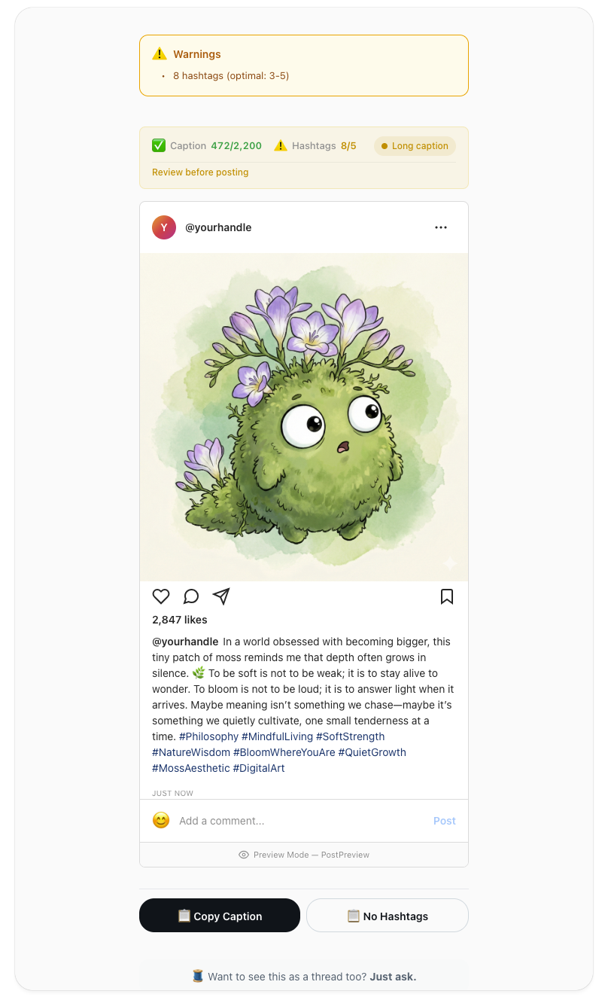
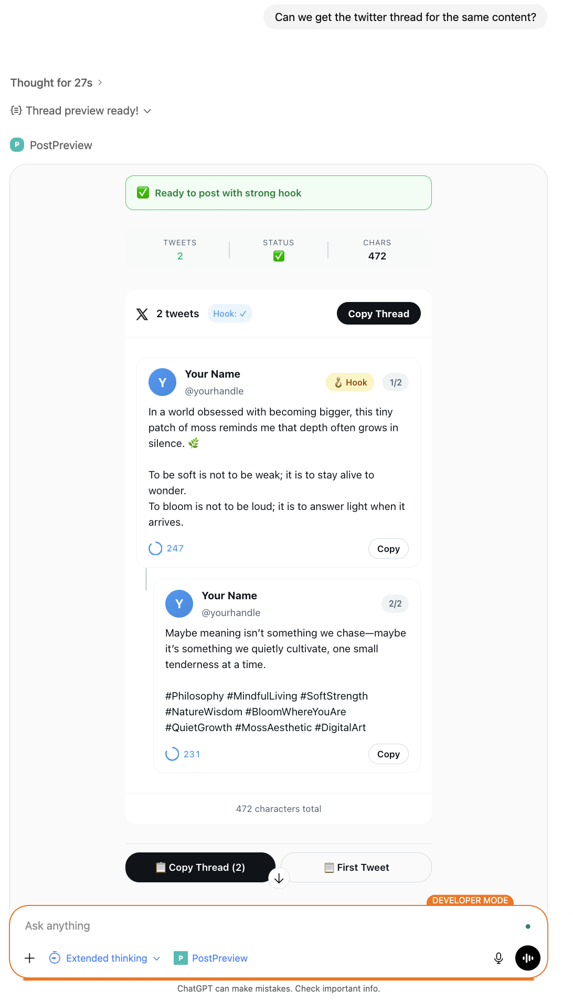
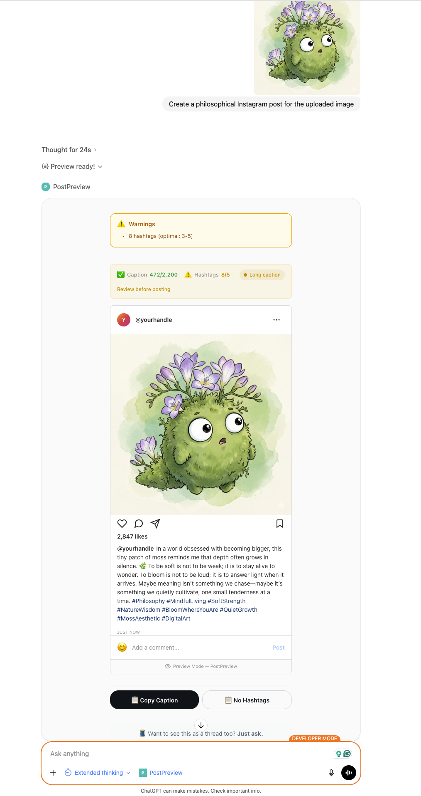

# PostPreview

**A ChatGPT-native app for previewing social media posts before publishing.**

Preview Instagram posts and Twitter/X threads directly in ChatGPT with realistic mockups, validation, and copy functionality.


---

## Screenshots

### Instagram Preview


### Twitter/X Thread Preview


### Full ChatGPT Integration


---

## Project Status

**Version 1 is complete!** Core features for Instagram and Twitter/X preview are fully functional.

**Version 2 is in planning.** See the [V2 Roadmap](./ROADMAP.md) for upcoming features including:
- Caption Quality Scoring
- Hashtag Suggestions
- Thread Hook Analysis
- Caption Variants
- Export Enhancements
- And more...

---

## Features

### Instagram Preview
- Realistic Instagram post mockup
- Caption validation (character limits, engagement tips)
- Hashtag counter and optimization
- Image dimension/aspect ratio validation
- One-click copy (with or without hashtags)

### Twitter/X Thread Preview
- Auto-split long content into threads
- Character count per tweet
- Hook quality analysis
- Thread validation and warnings
- Copy thread or individual tweets

### Multi-Platform
- Tabbed preview for both platforms at once
- Light/Dark mode support
- Responsive compact/fullscreen modes

---

## Quick Start

### Prerequisites
- Node.js 18+
- ChatGPT Plus with Developer Mode enabled
- ngrok (for local testing)

### Installation

```bash
# Clone the repository
git clone https://github.com/PantaAastha/PostPreview.git
cd PostPreview

# Install dependencies
npm install
cd mcp-server && npm install
cd ../web-component && npm install
cd ..
```

### Development

```bash
# Terminal 1: Build and watch web component
cd web-component && npm run build

# Terminal 2: Start MCP server
cd mcp-server && npm run build && npm start
```

### Connect to ChatGPT

1. **Expose your server:**
   ```bash
   ngrok http 3000
   ```

2. **In ChatGPT:**
   - Go to **Settings → Apps & Connectors → Connectors**
   - Click **Create** → paste `https://your-ngrok-url.ngrok.io/mcp`
   - Start a new chat and add your connector

3. **Try it:**
   - "Create an Instagram caption for my coffee photo"
   - "Turn this into a Twitter thread: [your content]"
   - "Create for both Instagram and Twitter"

---

## MCP Tools

| Tool | Description |
|------|-------------|
| `render_instagram_post` | Preview Instagram posts with validation |
| `render_x_thread` | Convert content to Twitter thread with preview |
| `render_multiplatform_post` | Preview for both platforms with tabs |

---

## Project Structure

```
PostPreview/
├── mcp-server/           # MCP Server (Node.js + TypeScript)
│   └── src/
│       └── index.ts      # Server, tools, and prompts
├── web-component/        # React Widget
│   └── src/
│       ├── components/   # UI components (InstagramPreview, XThreadPreview)
│       ├── hooks/        # OpenAI Apps SDK integration
│       └── utils/        # Validation, thread splitting
├── ROADMAP.md            # V2 feature roadmap
├── TEST_PROMPTS.md       # Golden prompt set for testing
└── README.md
```

---

## Testing

See [TEST_PROMPTS.md](./TEST_PROMPTS.md) for the complete testing guide including:
- Direct prompts (explicitly mention PostPreview)
- Indirect prompts (describe desired outcome)
- Negative prompts (should NOT trigger tool)

---

## Known Limitations

- **Widget State Persistence**: When multiple widgets are created in one conversation, older widgets may lose their data. This is a ChatGPT platform limitation.
- **MCP Prompts**: Starter prompts may not appear in developer mode connectors (works in published apps).

---

## License

MIT © [Aastha Panta](https://github.com/PantaAastha)
